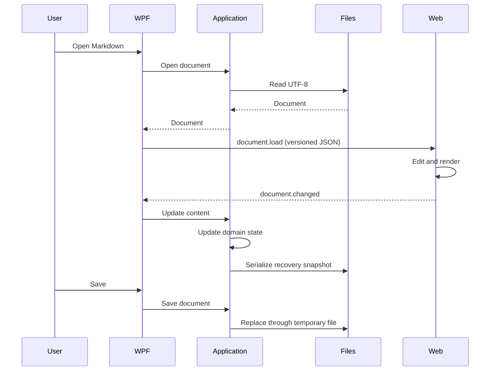

# Architecture

## Clean Architecture boundaries

| Layer | Responsibilities | May depend on |
|---|---|---|
| Domain | Documents, workspace concepts, invariants | .NET base libraries |
| Application | Document workflows, ports, messages, path-policy results, settings contracts | Domain |
| Infrastructure | Files, atomic writes, settings, recovery, watchers | Application, Domain |
| WPF App | Composition, native UI, dialogs, WebView2 adapter | Application, Infrastructure |
| Web | Editor, render pipeline, source mapping, synchronization | Browser libraries |

The domain does not know where a file comes from. Application defines ports such
as `IDocumentFileStore` and coordinates open, save, reload, content update, and
recovery behavior through `DocumentWorkflow`. Infrastructure implements the
ports. WPF owns presentation state, dialogs, and composition.

## Runtime flow

## Render concurrency

Each edit increments a document version. Rendering occurs in a detached DOM and
commits only when the document ID, version, and render generation are still
current. Mermaid render attempts also receive unique DOM IDs so concurrent loads
cannot collide. Stale renders cannot replace the preview or restore old viewport
positions. Web rendering is debounced, and Mermaid errors are isolated per
diagram.

## Presentation boundary

`MainViewModel` manages tab and document presentation state but delegates
document persistence and recovery sequencing to the Application layer.
`MainWindow` is the WPF/WebView2 adapter: it owns native dialogs, translates
versioned messages, and invokes Application workflows. The browser surface owns
CodeMirror, Markdown rendering, source mapping, and print-ready HTML.
