# Mermaid rendering acceptance cases

Use this document for the manual Windows acceptance pass. Open it in Markdown
Editor, inspect every numbered diagram in Preview and Split modes, then export
the full document to PDF and check that labels, lines, markers, and diagram
boundaries are not clipped.

Expected result: every section below displays one labeled diagram and no
`Mermaid error` block.

## 01 Flowchart

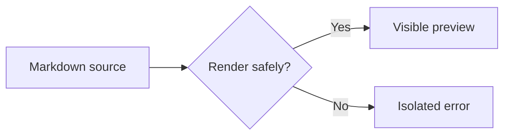

## 02 Sequence

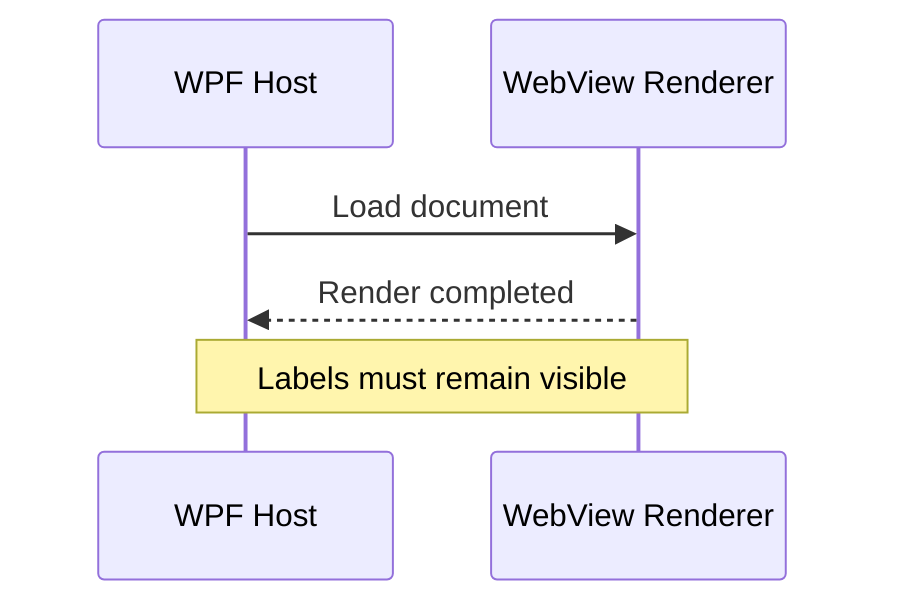

## 03 Class

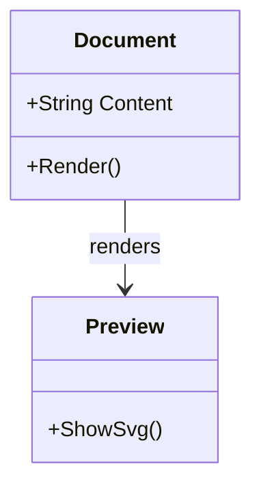

## 04 State v2

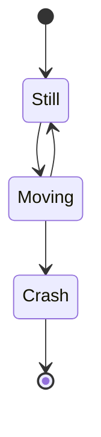

## 05 State legacy

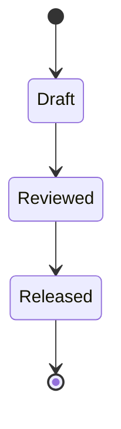

## 06 Entity relationship

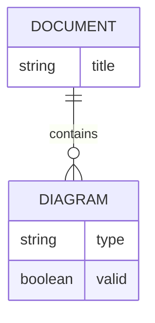

## 07 User journey

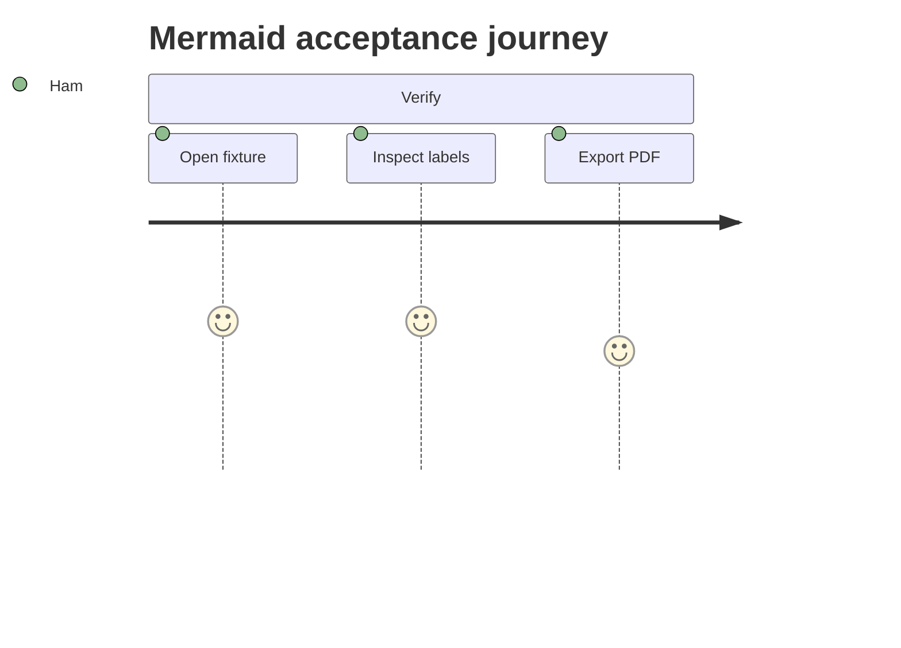

## 08 Gantt

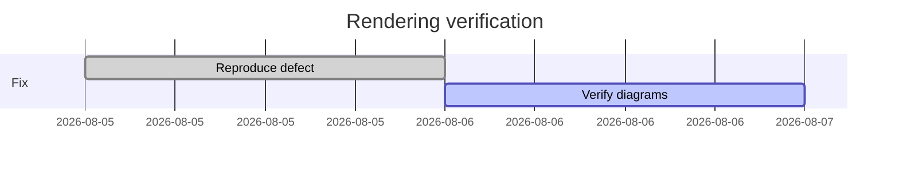

## 09 Pie

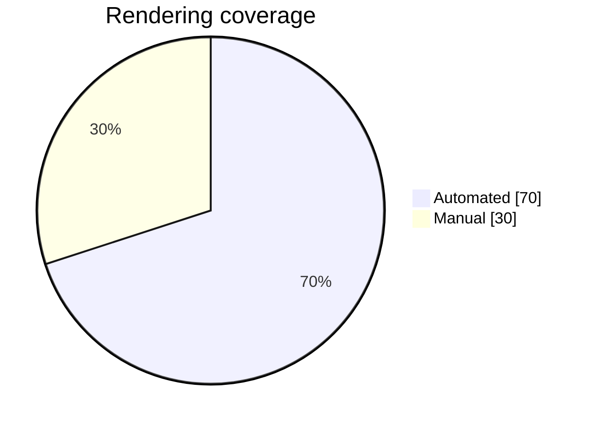

## 10 Quadrant

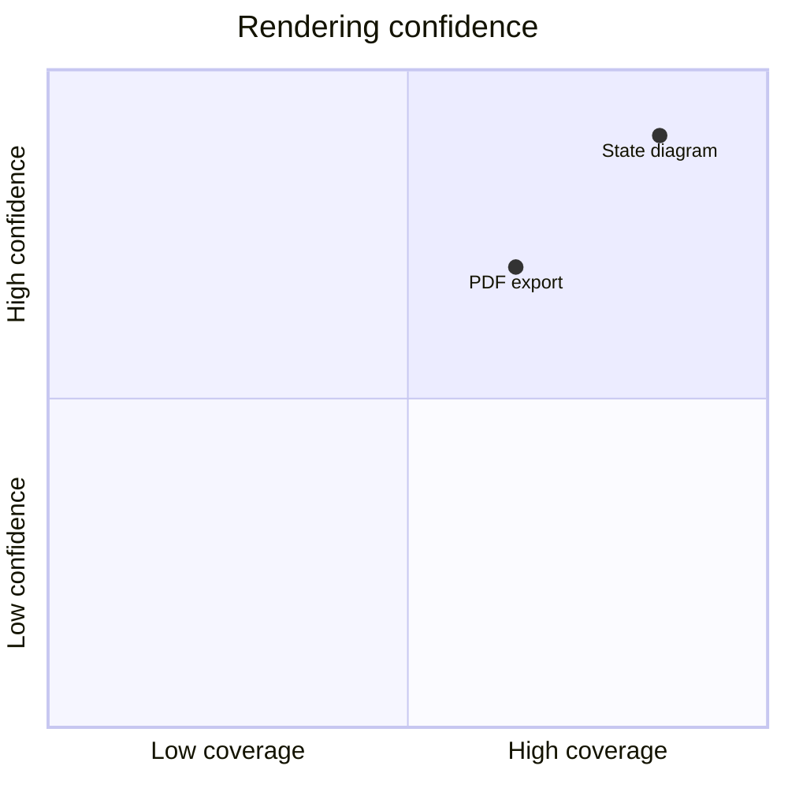

## 11 Requirement

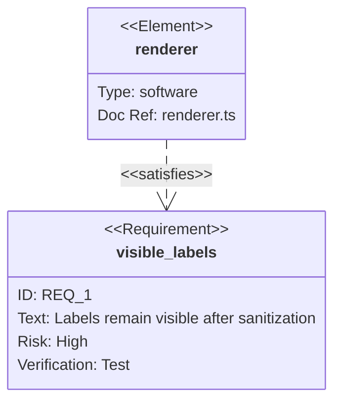

## 12 Git graph

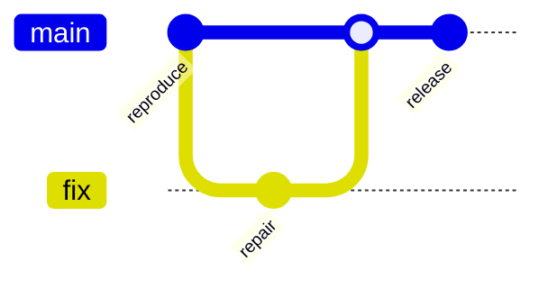

## 13 C4 context

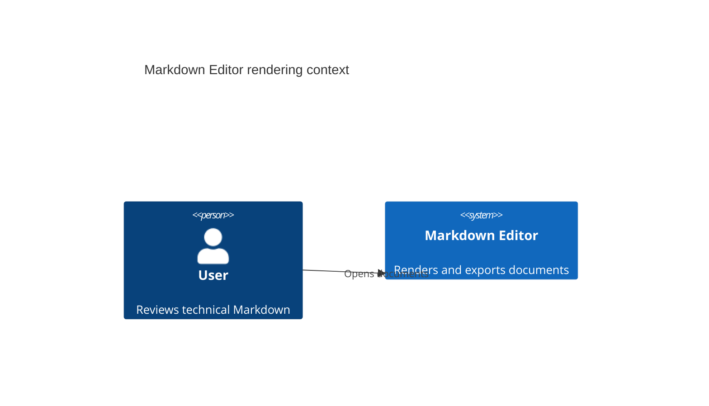

## 14 Mindmap

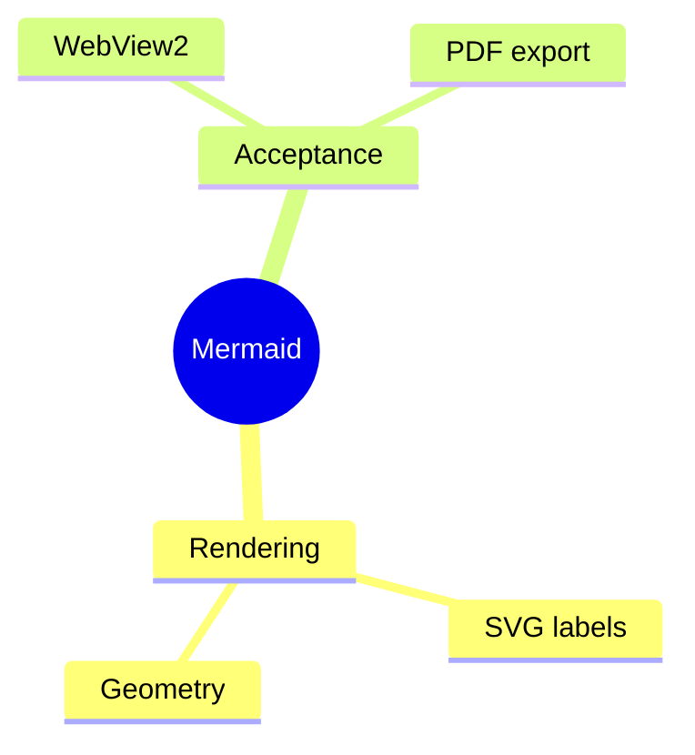

## 15 Timeline

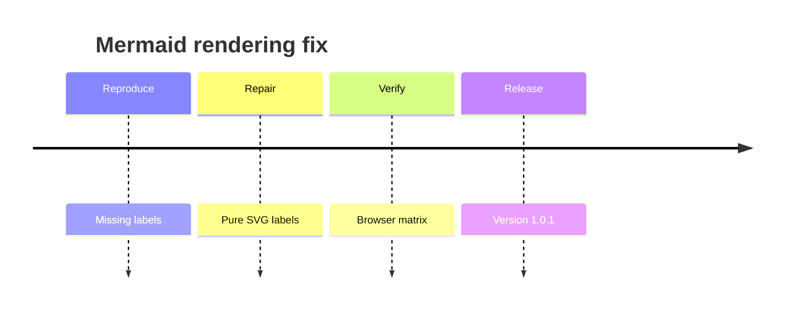

## 16 Sankey

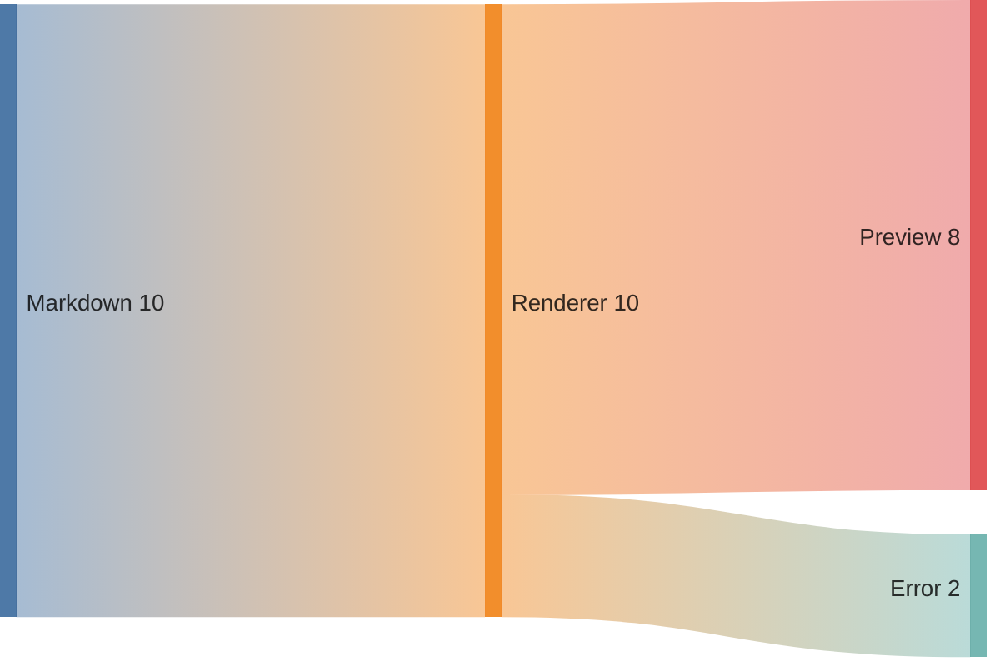

## 17 XY chart

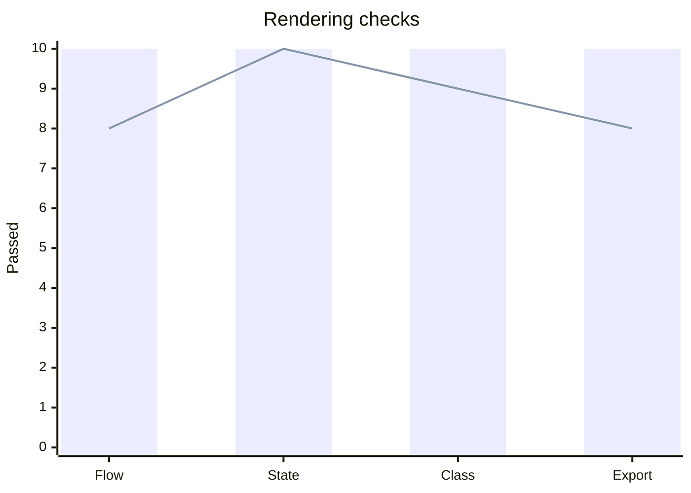

## 18 Block

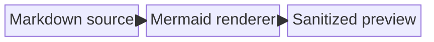

## 19 Packet

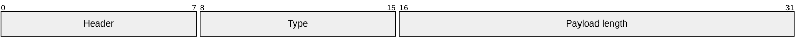

## 20 Kanban

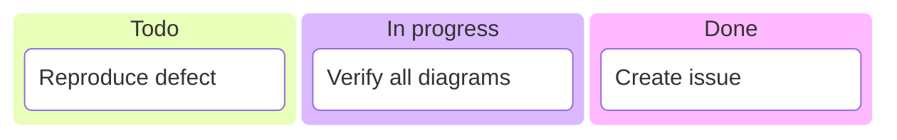

## 21 Architecture

```mermaid
architecture-beta
    service host(server)[WPF Host]
    service renderer(server)[Web Renderer]
    service preview(disk)[Preview]
    host:R -- L:renderer
    renderer:R -- L:preview
```

## 22 Radar

```mermaid
radar-beta
    axis parse["Parse"], sanitize["Sanitize"], labels["Labels"], export["Export"]
    curve current["Version 1.0.1"]{9, 9, 10, 8}
    max 10
    min 0
```

## 23 Treemap

```mermaid
treemap-beta
    "Rendering"
        "Automated tests": 60
        "Manual WebView2": 25
        "PDF export": 15
```
