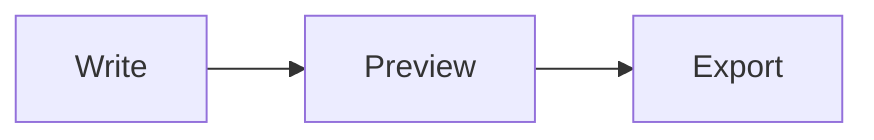

# Markdown Editor User Manual

Markdown Editor is a Windows desktop application for reading, editing, navigating,
and exporting technical Markdown documents. It combines a CodeMirror editor with
a rendered preview that supports Mermaid diagrams and syntax-highlighted code.

## Requirements

- Windows 10 or Windows 11, x64
- [.NET 9 Desktop Runtime (x64)](https://dotnet.microsoft.com/download/dotnet/9.0)
- Microsoft Edge WebView2 Runtime

WebView2 is normally included with current Windows installations. If the
application reports that WebView2 could not start, install the
[Evergreen WebView2 Runtime](https://developer.microsoft.com/microsoft-edge/webview2/).

## Install and start

1. Download the portable ZIP from the repository's
   [Releases page](https://github.com/sorawitphumwaree/markdown-editor/releases).
2. Extract the entire ZIP to a folder.
3. Run `MarkdownEditor.App.exe`.

Keep the published folder together. The executable requires the DLLs and `Web`
folder included in the package.

Starting the application directly creates an untitled document in Split mode.
Opening a `.md` or `.markdown` file from Windows opens it in Preview mode. If the
application is already running, the file opens as the active tab in that window.

## Main window

The window contains:

- **Explorer** on the left for files in an opened folder.
- **Document tabs** above the document area.
- **Preview/Split selector** in the toolbar.
- **Editor and preview** in the main document area.
- **Status bar** at the bottom for the latest application action.

Drag the divider in Split mode to change the space assigned to the editor and
preview.

## Open documents and folders

Use **File > Open** or `Ctrl+O` to open a Markdown document.

Use **File > Open Folder** to show a documentation folder in Explorer. Expand
folders and double-click a Markdown file to open it. Documentation images are
shown in Explorer, but native relative-image preview serving is not yet
implemented.

Opening an already-open document activates its existing tab instead of creating
a duplicate.

Drag a document tab horizontally to reorder it. A violet insertion line shows
where the tab will be placed. The active document and its unsaved content,
view mode, cursor, and scroll positions stay attached to the moved tab. The
order is retained while the application is running and resets after restart.

## Create, edit, and save

Use **File > New**, `Ctrl+N`, or `Ctrl+T` to create an untitled document.

In Split mode, edit Markdown on the left and view the rendered result on the
right. The preview updates shortly after content changes. Modified tabs display
a marker after the filename.

- Use `Ctrl+S` to save.
- Use `Ctrl+Shift+S` to save with a new filename.
- Use `Ctrl+W` to close the active tab.

Closing a modified tab asks whether to save, discard, or cancel. Right-click a
tab for Save, Export PDF, Reload from Disk, and Close commands. Reload requires
confirmation before discarding unsaved changes.

## Preview and Split modes

- **Preview** uses the full document area for rendered content.
- **Split** shows the source editor and preview side by side.

Each tab remembers its view mode, cursor line, editor position, and preview
position while it remains open.

## Markdown rendering

The preview supports CommonMark-style Markdown with GitHub Flavored Markdown
features such as tables and task lists. Fenced code blocks receive syntax
highlighting for common technical languages.

Raw HTML is sanitized before display. Scripts, iframes, objects, and embedded
content are blocked.

### Mermaid diagrams

Use a fenced code block with the `mermaid` language:

````markdown

````

Mermaid runs in strict security mode. If one diagram is invalid, its error is
shown without preventing the rest of the document from rendering.

## Navigate between source and preview

Navigation is click-driven:

- Click in the editor to move the preview to the matching rendered content.
- Click rendered content to move the editor to its source line.
- Manual scrolling in one pane does not move the other pane.

Detailed navigation is available for table rows, highlighted code lines, and
supported Mermaid Flowchart, Sequence, and Class elements. Other Mermaid types
fall back to diagram-level navigation.

## Links

Markdown links are resolved relative to the current document. Markdown targets
open in another tab. Same-document fragments move to the matching heading.
External URLs open through Windows in the default application.

When a folder is open as the workspace, relative links outside that folder are
rejected.

## Export PDF

Choose **File > Export PDF** or right-click a tab and select **Export PDF**.
The application waits for Markdown, Mermaid diagrams, code highlighting, fonts,
and images before creating the PDF.

The current release uses standard page settings. Custom paper size and margin
options are planned but not yet exposed.

## Keyboard shortcuts

| Shortcut | Command |
|---|---|
| `Ctrl+N` or `Ctrl+T` | New tab |
| `Ctrl+O` | Open Markdown file |
| `Ctrl+S` | Save |
| `Ctrl+Shift+S` | Save As |
| `Ctrl+W` | Close active tab |
| `Ctrl+Tab` | Next tab |
| `Ctrl+Shift+Tab` | Previous tab |

## Recovery and external changes

Unsaved edits are captured in local recovery snapshots. Automatic recovery
restore and external-file conflict dialogs are not yet available in the user
interface. Save important work normally and use Reload from Disk only when you
intend to replace the current tab content.

## Troubleshooting

## Translate an English word to Thai

Translation is available in Split view, where the source editor is visible.

1. Double-click an English word to select it.
2. Right-click the selected word and choose **Translate**.
3. Read the Thai translation and part of speech in the popup below the word.
4. Close the popup with its **X**, Escape, or a click elsewhere.

Only one word can be translated at a time, and translation never replaces or
otherwise changes the document. Choose **Settings > Translation** to configure
the language pair. The current release supports English to Thai; other
configurations show a non-blocking unsupported-pair message.

Translation is an online feature. It sends only the selected word—not the
surrounding sentence or document—to MyMemory for translation and Dictionary API
for optional English part-of-speech information.

### The application reports that WebView2 could not start

Install the Microsoft Edge WebView2 Evergreen Runtime and restart the
application.

### The document area is blank in a copied installation

Re-extract the complete portable ZIP. Do not copy only the executable; the
application also needs its DLLs and bundled `Web` directory.

### A relative image does not appear

Native relative-image serving is a known remaining feature. Use an HTTPS image
URL or open the image separately until local asset serving is implemented.

### A Mermaid diagram shows an error

Check the diagram syntax against the
[Mermaid documentation](https://mermaid.js.org/intro/). Errors are isolated to
the affected diagram.

## More information

- [Project README](../README.md)
- [Changelog](../CHANGELOG.md)
- [Product behavior](product-behavior.md)
- [Report a security issue](../SECURITY.md)
